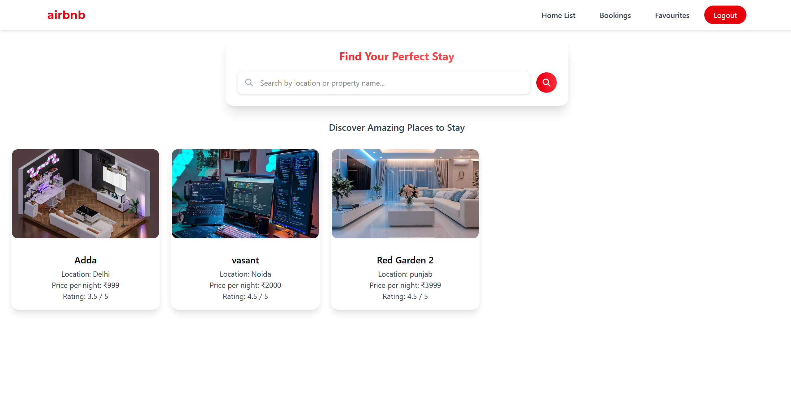

# 🏡 Airbnb Clone (Backend Practice Project)

This is a **practice Airbnb-style web application** built with **Node.js, Express, MongoDB, EJS, and Tailwind CSS**.  
It implements core features like user authentication, hosting homes, browsing homes, booking, and searching.
